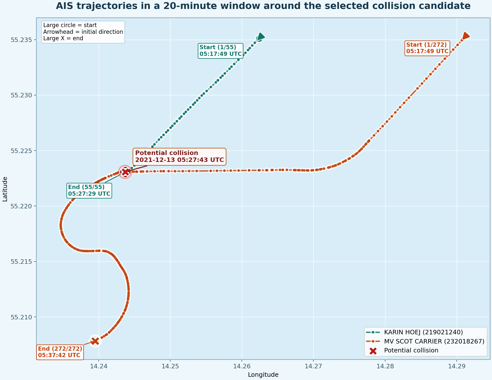

# AIS Collision Detection Report

## Objective

The task is to identify the collision, or closest collision-like encounter, inside a 50 nautical mile radius around `(55.225000, 14.245000)` during December 2021, while filtering out stationary vessels and noisy AIS behavior. The final deliverables must include the detected vessel pair, event time and coordinates, and a 10-minute before/after trajectory visualization.

## Method

The solution is implemented in PySpark so the raw monthly AIS data can be processed with distributed transformations instead of loading the full dataset into Pandas.

The pipeline works in four main stages:

1. Load and clean AIS records.
   - Keep only valid vessel positions and timestamps.
   - Restrict data to the required 50 nm search area.
   - Exclude anchored, moored, and otherwise stationary traffic.
   - Remove obvious GPS jumps using implied-speed checks between consecutive pings.

2. Generate encounter candidates efficiently.
   - Bucket vessel positions by time and spatial grid.
   - Compare only nearby vessel pairs instead of using a full Cartesian product.
   - Rank the closest raw candidates by distance, timing, and vessel type heuristics.

3. Rebuild local trajectories for each strong candidate.
   - Export a 10-minute before/after window for both vessels.
   - Interpolate both tracks onto the same timeline so separation and heading can be compared fairly.

4. Apply stricter collision validation.
   - Reject service, pilot, rescue, and similar helper-vessel encounters.
   - Reject parallel same-track traffic using heading similarity and route overlap.
   - Require post-event disruption, specifically a track ending near the event and a strong post-event speed drop.
   - Allow either a very close synchronized separation or a crossing-style collision pattern.

This stricter validation is important because the raw monthly AIS feed contains many close encounters that are not collisions.

## Result

The final selected vessel pair is:

- MMSI `219021240` — `KARIN HOEJ`
- MMSI `232018267` — `MV SCOT CARRIER`

Detected event summary:

- Collision timestamp: `2021-12-13 05:27:43 UTC`
- Collision coordinates: `55.223079, 14.243707`
- Closest observed AIS distance: `4.076 m`

Encounter assessment from the final output:

- Synchronized minimum distance: `74.724 m`
- Heading difference: `27.937 deg`
- Route overlap fraction: `0.0`
- Track-end anomalies: `1`
- Speed-drop anomalies: `1`
- Parallel encounter: `false`
- Confirmed collision-like: `true`

These signals are consistent with a crossing-style impact rather than two vessels traveling together in parallel.

## Discussion

The `top_candidates` list contains several close encounters from the same day, but those are only shortlisted possibilities. The stricter trajectory checks discard many of them because they are rescue/service traffic, pilot interactions, same-lane motion, or close passes with no disruptive change after the event.

This is why the pipeline no longer forces one result per day. A day may contain no valid collision-like event at all. The batch run therefore keeps only daily winners that survive the strict validation and then selects one global month-level winner.

## Visualization

The final 20-minute trajectory visualization is embedded below.



## Reproducibility

Local full-month run:

```powershell
$env:PYTHONPATH='src'
$env:PYTHONUNBUFFERED='1'
.\.venv\Scripts\python.exe -u -m ais_collision.batch --input-glob "Data/aisdk-2021-12-*.csv" --output-dir "output/full-month" --master "local[6]" --driver-memory "12g" --shuffle-partitions 200
```

Docker build and run:

```powershell
docker build -t ais-collision-detector .
docker compose up --build
```